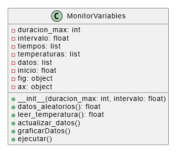

# Lab03: Visualización interactiva de datos en Raspberry Pi usando Python y Matplotlib

## Integrantes

DILAN JESUS MENDOZA GUARIYU 84670 

EINER JULIAN AGUDELO ACOSTA 105352 

HASBLEIDY JOHANNA SILVA ESCARRAGA 110002

## Documentación
Diagrama de clases



Datos del codigo Inicial


Datos Aleatorios Generados por Codigo

.jpeg>)

Datos de codigo con lecturas Aleatorias y del Sistema

.jpeg>)

Monitor de Temperatura en Raspberry Pi


# Visualización interactiva de datos en Raspberry Pi usando Python y Matplotlib

## Descripción del Proyecto:
Este proyecto consiste en un script en Python para monitorear la temperatura de la CPU de una Raspberry Pi en tiempo real. El programa obtiene la temperatura del sistema mediante comandos del sistema operativo, almacena los datos temporalmente y los muestra en una gráfica dinámica usando Matplotlib.

El objetivo principal es visualizar el comportamiento térmico del procesador mientras la Raspberry Pi está en funcionamiento, lo cual permite analizar el rendimiento del sistema y detectar posibles problemas de sobrecalentamiento.

## CONTENIDO 

- [Características](#características)
- [Arquitectura](#arquitectura)
- [Requisitos de Hardware](#requisitos-de-Hardware)
- [Estructura de Clases](#estructura-de-clases)
- [API de Referencia](#api-de-referencia)
- [Funcionalidades Implementadas](#funcionalidades-Implementadas)
- [Tecnologías Utilizadas](#tecnologías-Utilizadas)
- [Desafíos técnicos](#desafíos-técnicos)
- [Mejoras Futuras](#mejoras-Futuras)
- [Preguntas](#preguntas)

## Características

- Lectura de temperatura real del CPU vía `vcgencmd measure_temp`
- Simulación de datos de sensor secundario (valores aleatorios 35-50°C)
- Visualización gráfica en tiempo real con matplotlib
- Ventana deslizante de 60 segundos de historial
- Doble trazado: datos simulados (rojo) + temperatura real (verde)
- Interfaz gráfica accesible remotamente por VNC Viewer


## Arquitectura
┌─────────────────┐     ┌─────────────────┐     ┌─────────────────┐
│  Raspberry Pi   │────→│   VNC Server    │────→│   VNC Viewer    │
│   Zero W        │     │  (interfaz X11) │     │  (PC/Tablet)    │
└─────────────────┘     └─────────────────┘     └─────────────────┘
│
├──→ vcgencmd (temp real)
└──→ random.uniform() (simulación)

**Componentes software:**
- `matplotlib` → Renderizado gráfico
- `subprocess` → Lectura de temperatura del sistema
- `time` → Control de intervalos de muestreo

## Requisitos de Hardware

| Componente | Especificación |
|------------|---------------|
| Placa | Raspberry Pi Zero W |
| Conectividad | WiFi integrado |
| Alimentación | 5V 2.5A micro USB |
| Opcional | GPIO para sensor físico futuro |


## Estructura de Clases

MonitorVariables
├── __init__(duracion_max=60, intervalo=0.5)
│   └── Inicializa figura matplotlib y arrays de datos
├── datos_aleatorios()
│   └── Retorna float entre 35-50°C (simulación sensor)
├── leer_temperatura()
│   └── Ejecuta vcgencmd, parsea y retorna temperatura CPU
├── actualizar_datos()
│   └── Añade muestras, mantiene ventana temporal deslizante
├── graficarDatos()
│   └── Dibuja líneas roja (simulado) y verde (real)
└── ejecutar()
    └── Loop principal con manejo de KeyboardInterrupt


## API de Referencia

| Método             | Parámetros                         | Retorno       | Descripción                                       |
| ------------------ | ---------------------------------- | ------------- | ------------------------------------------------- |
| `__init__`         | `duracion_max=60`, `intervalo=0.5` | -             | Constructor. Define ventana temporal y frecuencia |
| `datos_aleatorios` | -                                  | `float\|None` | Genera valor simulado de sensor                   |
| `leer_temperatura` | -                                  | `float\|None` | Obtiene temperatura CPU vía `vcgencmd`            |
| `actualizar_datos` | -                                  | -             | Gestiona buffers circulares de datos              |
| `graficarDatos`    | -                                  | -             | Actualiza canvas matplotlib en tiempo real        |
| `ejecutar`         | -                                  | -             | Inicia bucle de monitoreo continuo                |


## Funcionalidades Implementadas
1. Lectura de temperatura de la CPU

El programa obtiene la temperatura del procesador utilizando el comando del sistema:
vcgencmd measure_temp
Este comando es ejecutado desde Python mediante el módulo subprocess, lo que permite capturar la salida del sistema y procesarla para obtener el valor numérico de la temperatura.
La temperatura se convierte a tipo float para poder ser utilizada en cálculos y visualizaciones.

2. Monitoreo en tiempo real

El script realiza lecturas periódicas de la temperatura utilizando un intervalo de tiempo definido por el usuario.
Esto significa que el sistema registra una nueva medición cada 0.5 segundos, permitiendo observar cambios de temperatura casi en tiempo real.
Para evitar un uso excesivo del procesador, se utiliza:


3. Registro temporal de datos

El programa almacena los datos en dos listas:
* self.tiempos → almacena el tiempo transcurrido desde el inicio del monitoreo.

* self.temperaturas → almacena las temperaturas registradas.

El tiempo se calcula con:
time.time() - self.inicio
Esto permite mostrar el tiempo relativo desde que comenzó la medición, facilitando la interpretación de la gráfica.

4. Visualización gráfica dinámica

La visualización de los datos se realiza utilizando la librería Matplotlib en modo interactivo.
plt.ion()
La gráfica se actualiza continuamente mostrando:

Eje X → tiempo transcurrido

Eje Y → temperatura de la CPU en °C

Antes de actualizar la gráfica se utiliza:
self.ax.clear()
Esto evita que las líneas anteriores se acumulen y garantiza que solo se muestre la información actualizada.

5. Ventana de monitoreo interactiva

El ciclo principal del programa se mantiene activo mientras la ventana de la gráfica esté abierta:
plt.fignum_exists(self.fig.number)
Esto permite que el programa finalice automáticamente cuando el usuario cierra la ventana de la gráfica.

6. Manejo de errores

El programa incluye un bloque try-except en la función de lectura de temperatura para manejar posibles errores, por ejemplo:
* Fallo en el comando del sistema
* Problemas de permisos
* Error en la lectura del sensor
* Esto evita que el programa se detenga inesperadamente.

## Tecnologías Utilizadas

Python 3
Matplotlib → Visualización gráfica
Subprocess → Ejecución de comandos del sistema
Time → Control del tiempo y frecuencia de medición
Estructura del Código
El programa está organizado en una clase llamada:
MonitorTemperaturaRPI

## Desafíos técnicos

1. Lectura correcta de la temperatura

El comando vcgencmd measure_temp devuelve una cadena de texto, por lo que fue necesario procesar la salida del comando para obtener únicamente el valor numérico de la temperatura.

2. Actualización de la gráfica en tiempo real

Inicialmente la gráfica no se actualizaba correctamente. Esto se solucionó utilizando el modo interactivo de Matplotlib (plt.ion()) y actualizando el canvas en cada iteración del ciclo.

3. Control del consumo de CPU

Sin el uso de time.sleep(), el programa ejecutaba el ciclo demasiado rápido, consumiendo recursos innecesarios del sistema. Se solucionó estableciendo un intervalo de actualización adecuado.

4. Finalización correcta del programa

Fue necesario implementar una forma de terminar el monitoreo sin forzar el cierre del programa. Esto se resolvió verificando si la ventana de la gráfica seguía abierta.


###  Mejoras Futuras

Algunas mejoras que podrían implementarse en futuras versiones del proyecto incluyen:
Guardar los datos de temperatura en un archivo CSV.
Monitorear uso de CPU y memoria RAM.
Mostrar alertas cuando la temperatura supere cierto límite.
Implementar monitoreo remoto.

## Preguntas

### 1. ¿Qué función cumple ```plt.fignum_exists(self.fig.number)``` en el ciclo principal?

Con esta función podemos primero verificar que la ventana grafica todavía existe, y asi el programa se siga ejecutando hasta que el usuario cierre eta ventana y plt.fignum_exists() devuelve la false y el ciclo termina automáticamente.

### 2. ¿Por qué se usa ```time.sleep(self.intervalo)``` y qué pasa si se quita?

Principalmente se usa para generar pausas en el programa durante cierto tiempo para lograr obtener lecturas de la temperatura cada 0.5 segundos en este caso, en el caso que se quite o comentemos esta función el ciclo while se ejecutaría miles de veces por segundo 

### 3. ¿Qué ventaja tiene usar ```__init__``` para inicializar listas y variables?

inicialmente es el contructor de la clase y se ejecuta automaticamente cuando creamos el objeto para este caso monitor = MonitorTemperaturaRPI() y las ventajas principales obtendriamos inicia todas las variables del codigo, deja los objetos listos para usarse, evita errores por variables no definidas y organiza el codigo 

### 4. ¿Qué se está midiendo con ```self.inicio = time.time()```?

Este metodo inicialmente devuelve el tiempo actual del sistema en segundos y aca lo usamos para marcar en que momento empieza el monitoreo y luego del calculo logrmos obtener cuantos segundos han pasado desde que el programa e ejecuto

### 5. ¿Qué hace exactamente ```subprocess.check_output(...)```?

esta funcion se encarga de jecutar el comando dentro del sistema operativo que captura la salida y la devuelve al programa cuando se ejecuta logramos obtener en las temperaturas a las cuales se encuentra la Raspberry 

### 6. ¿Por qué se almacena ```ahora = time.time() - self.inicio``` en lugar del tiempo absoluto?

Lo aplicamos para lograr ver cuanto tiempo ha pasado desde que comenzo el monitoro y nos permite simplificar la salida en segundos y asi no obtener numeros tan grandes para obtener mejor datos en la grafica

### 7. ¿Por qué se usa ```self.ax.clear()``` antes de graficar?

principalmente se usar para hacer un borrado de la grafica anterior y asi podamos obtener una nueva y asi no obtener doble grafica o graficas ya generadas anteriormente tomando en si siempre los ultimos datos recopilados por el sistema

### 8. ¿Qué captura el bloque ```try...except``` dentro de ```leer_temperatura()```?

Esto principalmente se encarga de capturar los errores al ejecutar el comando del sistema ejemplo si la raspberry no responde si hay errores de permiso o si el comando falla y el except evita que el programa se cierre y muestra el mensaje Error leyendo temperatura

### 9. ¿Cómo podría modificar el script para guardar las temperaturas en un archivo .```csv```?

podriamos usar el modulo csv. primero agregando import csv luego 

Creando el __init__ agregando 
self.archivo = open("temperaturas_rpi.csv", "w", newline="")
self.writer = csv.writer(self.archivo)
self.writer.writerow(["Tiempo", "Temperatura"])

Continuamos en actualizar_datos():
self.writer.writerow([ahora, temp]) y cerrando e archivo con 
self.archivo.close()  y al final obteniendo datos como 

Tiempo,Temperatura
0.5,45.2
1.0,45.3
1.5,45.4
2.0,45.5

los cuales podriamos abrir en Excel, Matlab o Python


